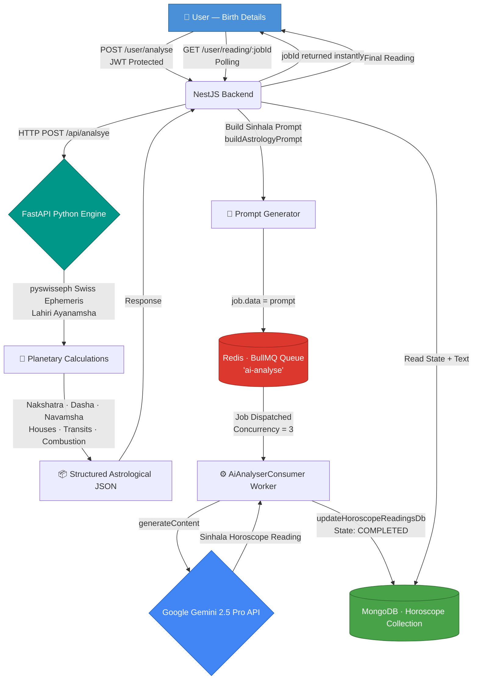

# ✨ Hadahana — AI-Powered Vedic Astrology Reading System

<p align="center">
  
  
  
  
  
  
  
  
  
</p>

---

## 📖 Overview

**Hadahana** (හදහන — *"the reading of fate"*) is an enterprise-grade, AI-powered Vedic astrology platform built for precision and scale. It accepts a user's birth details (date, time, and geographic coordinates), computes a complete sidereal birth chart using the **Swiss Ephemeris** (`pyswisseph`) via the Lahiri Ayanamsha, and then constructs a richly contextualised natural-language horoscope reading in **Sinhala** using **Google Gemini 2.5 Pro**.

The system is intentionally split into two decoupled microservices:

| Service | Role |
|---|---|
| **NestJS Backend** | Authentication, user management, job orchestration, polling API |
| **FastAPI Python Engine** | High-precision ephemeris calculations, Nakshatra/Dasha/Navamsha derivations |

Long-running AI inference is offloaded to a **BullMQ** worker queue backed by **Redis**, preventing HTTP timeouts and enabling horizontal scaling of AI workers.

---

## 🏛️ System Architecture

The following diagram illustrates the complete request lifecycle, from the user's browser to the final personalised reading stored in MongoDB.



---

## 🔢 Mathematical Core — Vedic Astronomy Engine

This section details the precise mathematical framework implemented inside `python-engine/main.py` using the `pyswisseph` library.

---

### 1. The 360° Zodiac — Rashis and Nakshatras

The ecliptic longitude of any celestial body, obtained from `swe.calc_ut()` with the `swe.FLG_SIDEREAL` flag, is a value $\lambda \in [0°, 360°)$.

```
╔══════════════════════════════════════════════════════════════════════════╗
║              THE 360° SIDEREAL ZODIAC (Lahiri Ayanamsha)                ║
╠══════════════════════════════════════════════════════════════════════════╣
║                                                                          ║
║   Rashis (12 Signs × 30° each)                                           ║
║   ─────────────────────────────────────────────────────────────────────  ║
║    0°      30°     60°     90°    120°    150°    180°                   ║
║    │  Mesha │Vrishabha│ Mithuna│ Kataka │ Simha  │ Kanya  │             ║
║    └────────┴─────────┴────────┴────────┴────────┴────────┘             ║
║   180°     210°    240°    270°    300°    330°   360°                   ║
║    │  Tula  │Vrischika│  Dhanu │ Makara │ Kumbha │ Meena  │             ║
║    └────────┴─────────┴────────┴────────┴────────┴────────┘             ║
║                                                                          ║
║   Nakshatras (27 Lunar Mansions × 13°20' / 13.333° each)                ║
║   ─────────────────────────────────────────────────────────────────────  ║
║    Each Nakshatra is divided into 4 Padas (quarters) × 3°20' / 3.333°   ║
║                                                                          ║
║    ┌──────────────┬──────────────┬──────────────┬──────────────┐        ║
║    │   Pada 1     │   Pada 2     │   Pada 3     │   Pada 4     │        ║
║    │   0° – 3°20' │ 3°20'– 6°40' │ 6°40'–10°00' │10°00'–13°20'│        ║
║    └──────────────┴──────────────┴──────────────┴──────────────┘        ║
║                    ◄───────── 13.333° ──────────►                       ║
║                                                                          ║
║   Total: 27 × 4 = 108 Padas — the sacred number in Vedic cosmology      ║
╚══════════════════════════════════════════════════════════════════════════╝
```

**Rashi (Sign) Index:**

$$\text{RashiIndex} = \left\lfloor \frac{\lambda}{30} \right\rfloor$$

**Nakshatra Index** (Moon longitude $\lambda_{\text{moon}}$):

The length of each Nakshatra in degrees:

$$L_{nak} = \frac{360°}{27} \approx 13.\overline{3}°$$

$$\text{NakshatraIndex} = \left\lfloor \frac{\lambda_{\text{moon}}}{L_{nak}} \right\rfloor = \left\lfloor \frac{\lambda_{\text{moon}} \times 27}{360} \right\rfloor$$

**Pada (Quarter) within the Nakshatra:**

$$L_{pada} = \frac{L_{nak}}{4} = \frac{360°}{108} \approx 3.\overline{3}°$$

$$\text{Pada} = \left\lfloor \frac{\lambda_{\text{moon}} \bmod L_{nak}}{L_{pada}} \right\rfloor + 1$$

**Percentage traversed through current Nakshatra** (used for Dasha balance):

$$p = \frac{\lambda_{\text{moon}} \bmod L_{nak}}{L_{nak}} \in [0, 1)$$

```python
# Implemented in main.py
nakshatra_len = 360 / 27.0
nak_idx       = int(moon_lon / nakshatra_len)
paadaya       = int((moon_lon % nakshatra_len) / (nakshatra_len / 4.0)) + 1
passed_pct    = (moon_lon % nakshatra_len) / nakshatra_len
```

---

### 2. Navamsha (D9) Chart Calculation

The Navamsha chart is the ninth harmonic division — each 30° sign is split into **9 equal parts of 3°20' (3.333°)** each, producing a secondary chart with profound significance in marriage and soul-path analysis.

```
╔═══════════════════════════════════════════════════════════════╗
║       NAVAMSHA DIVISION (D9) — One Sign = 9 × 3°20'          ║
╠═══════════════════════════════════════════════════════════════╣
║                                                               ║
║  Mesha (Aries): 0° ─────────────────────────────────── 30°   ║
║                                                               ║
║  │  D9-1  │  D9-2  │  D9-3  │  D9-4  │  D9-5  │  ...  │     ║
║  │  0°    │ 3°20'  │ 6°40'  │ 10°00' │ 13°20' │       │     ║
║  │ Mesha  │Vrishabh│ Mithuna│ Kataka │ Simha  │       │     ║
║  └────────┴────────┴────────┴────────┴────────┴───────┘     ║
║            ◄── 3.333° ──►                                    ║
║                                                               ║
║  The 9 D9 signs cycle through all 12 Rashis continuously     ║
║  across all 12 signs, producing 12×9 = 108 Navamsha padas.   ║
╚═══════════════════════════════════════════════════════════════╝
```

The **global Navamsha index** treats the entire zodiac as 108 consecutive cells:

$$\text{NavamshaIndex}_{global} = \left\lfloor \frac{\lambda \times 3}{10} \right\rfloor$$

Since there are only 12 Rashis, we wrap this into a 12-cycle:

$$\text{NavamshaRashiIndex} = \left\lfloor \frac{\lambda \times 3}{10} \right\rfloor \pmod{12}$$

```python
# Implemented in main.py
def get_navamsha(degree):
    navamsha_index = int((degree * 3) / 10) % 12
    return RASHIS[navamsha_index]
```

> **Why `× 3 / 10`?** — Each degree spans $\frac{9}{30} = 0.3$ Navamsha cells, so $\lambda \times 0.3 = \lambda \times \frac{3}{10}$.

---

### 3. Bhava (House) Calculation — Relative to Lagna

The Ascendant (Lagna) degree is calculated via `swe.houses_ex()` using the **Placidus** house system with the sidereal flag. The house of any planet is its position *relative to the Lagna sign*, counted inclusively.

```
╔══════════════════════════════════════════════════════════════════╗
║              BHAVA WHEEL — Relative House Formula               ║
╠══════════════════════════════════════════════════════════════════╣
║                                                                  ║
║                    10th ▲                                        ║
║                 9th  │  11th                                     ║
║              8th     │     12th                                  ║
║    7th ◄─────────────┼─────────────► 1st (Lagna)                ║
║              6th     │     2nd                                   ║
║                 5th  │  3rd                                      ║
║                    4th ▼                                         ║
║                                                                  ║
║  House = ((PlanetRashiIndex − LagnaRashiIndex) mod 12) + 1      ║
║                                                                  ║
║  Example: Lagna in Mesha (idx=0), Planet in Kanya (idx=5)       ║
║           House = ((5 − 0) mod 12) + 1 = 6th Bhava             ║
╚══════════════════════════════════════════════════════════════════╝
```

$$\text{House}(P) = \left( (\text{RashiIndex}_P - \text{RashiIndex}_{Lagna}) \bmod 12 \right) + 1$$

```python
# Implemented in main.py
def get_house(lagna_index, planet_rashi_index):
    return ((planet_rashi_index - lagna_index) % 12) + 1
```

---

### 4. Planetary States — Retrograde & Combustion

**Retrograde** is detected from the planet's ecliptic speed (the 4th component of `swe.calc_ut()` with `swe.FLG_SPEED`):

$$\text{IsRetrograde} = \begin{cases} \text{True} & \text{if } \dot{\lambda} < 0 \\ \text{False} & \text{otherwise} \end{cases}$$

**Combustion** measures the angular separation between a planet and the Sun. A planet is declared *combust* (Muḍha) if it approaches within 10°:

$$\Delta = | \lambda_P - \lambda_{\odot} |$$

$$\Delta_{adj} = \begin{cases} 360° - \Delta & \text{if } \Delta > 180° \\ \Delta & \text{otherwise} \end{cases}$$

$$\text{IsCombust} = \begin{cases} \text{True} & \text{if } \Delta_{adj} \leq 10° \\ \text{False} & \text{otherwise} \end{cases}$$

> *Note: The Moon and Rahu/Ketu are excluded from combustion checks by design, as per classical Jyotisha rules.*

**Ketu** is the south node, always exactly opposite Rahu:

$$\lambda_{\text{Ketu}} = (\lambda_{\text{Rahu}} + 180°) \bmod 360°$$

---

### 5. Vimshottari Dasha System

The Vimshottari Dasha is a 120-year cycle of planetary periods (Mahadashas), sequenced by the Nakshatra the Moon occupied at birth.

```
╔══════════════════════════════════════════════════════════════════════╗
║            VIMSHOTTARI DASHA CYCLE  (Total = 120 years)             ║
╠════════════╦═══════════╦══════════════════════════════════════════╣
║  Sequence  ║ Lord      ║  Duration  (sum = 120 yrs)               ║
╠════════════╬═══════════╬══════════════════════════════════════════╣
║     1      ║ Ketu      ║  7 years                                 ║
║     2      ║ Venus     ║ 20 years  ← longest                      ║
║     3      ║ Sun       ║  6 years                                 ║
║     4      ║ Moon      ║ 10 years                                 ║
║     5      ║ Mars      ║  7 years                                 ║
║     6      ║ Rahu      ║ 18 years                                 ║
║     7      ║ Jupiter   ║ 16 years                                 ║
║     8      ║ Saturn    ║ 19 years                                 ║
║     9      ║ Mercury   ║ 17 years                                 ║
╚════════════╩═══════════╩══════════════════════════════════════════╝
  The cycle repeats from Ketu after Mercury.
```

**Step 1 — Identify the birth Mahadasha lord:**

$$\text{DashaIndex} = \text{NakshatraIndex} \bmod 9$$

**Step 2 — Remaining years of the birth Dasha** (using the traversed percentage $p$ of the Moon through its Nakshatra):

$$\text{BalanceYears} = \text{TotalYears}_{D} \times (1 - p)$$

**Step 3 — Advance the Dasha timeline** using exact UTC timestamps to avoid timezone ambiguity:

$$\text{YearsPassed} = \frac{(\text{Datetime}_{now,UTC} - \text{DatetimeBirth}_{UTC})\text{ in days}}{365.25}$$

The system iterates through successive Mahadasha lords (modulo 9 wraparound) subtracting their durations until the current lord is found:

```
YearsPassed ─── < BalanceYears? ──► Still in birth Dasha
                │
                └── No ──► YearsPassed -= BalanceYears
                           Advance to next lord, subtract duration,
                           repeat until YearsPassed < lord duration
```

**Antardasha (Sub-period) Duration:**

The Antardasha duration for lord $j$ within Mahadasha lord $i$ is proportional:

$$D_{AD}(j) = \frac{\text{TotalYears}_{i} \times \text{TotalYears}_{j}}{120}$$

```python
# Implemented in main.py
ad_duration = (md_duration * ad_lord_duration) / 120.0
```

---

## 🛠️ Tech Stack

### NestJS Backend (`/src`)
| Layer | Technology |
|---|---|
| Framework | NestJS 11 (TypeScript) |
| Authentication | JWT (Access + Refresh tokens), Passport.js, Argon2 |
| Database | MongoDB via Mongoose |
| Relational DB | PostgreSQL via Prisma (adapter-pg) |
| Job Queue | BullMQ + Redis |
| HTTP Client | `@nestjs/axios` |
| Validation | `class-validator`, `class-transformer` |
| API Docs | Swagger (`@nestjs/swagger`) |

### Python Calculation Engine (`/python-engine`)
| Layer | Technology |
|---|---|
| Framework | FastAPI |
| Ephemeris Library | `pyswisseph` (Swiss Ephemeris) |
| Ayanamsha | Lahiri / Chitrapaksha |
| House System | Placidus |
| Timezone | `pytz` (Asia/Colombo → UTC conversion) |

### AI & Infrastructure
| Component | Technology |
|---|---|
| LLM | Google Gemini 2.5 Pro (`@google/generative-ai`) |
| Message Broker | Redis 7+ |
| Queue Worker | BullMQ Consumer (concurrency: 3) |
| Containerisation | (Docker-ready) |

---

## ⚙️ Setup & Installation

### Prerequisites

- **Node.js** ≥ 20
- **Python** ≥ 3.11
- **Redis** server running on `localhost:6379`
- **MongoDB** instance (local or Atlas)
- A **Google AI Studio** API key

---

### 1. Clone the Repository

```bash
git clone https://github.com/dumidulkdev/Hadahana.git
cd Hadahana
```

---

### 2. Configure Environment Variables

Create a `.env` file in the project root:

```bash
cp .env.example .env   # or create manually
```

```dotenv
# Application
PORT=3000

# MongoDB
MONGO_DATABASE_URI=mongodb://localhost:27017/hadahana

# JWT
JWT_ACCESS_SECRET=your_super_secret_access_key_here
JWT_REFRESH_TOKEN=your_super_secret_refresh_key_here

# Python Calculation Engine
ENGINE_BASE_URL=http://localhost:8000
ENGINE_BASE_PATH=/api/analsye

# Google Gemini AI
GEN_AI_API_KEY=your_gemini_api_key_here
```

> Obtain your Gemini API key from [Google AI Studio](https://aistudio.google.com/app/apikey).

---

### 3. Start Redis

```bash
# Using Docker (recommended)
docker run -d -p 6379:6379 redis:7-alpine

# Or via system package manager (Ubuntu/Debian)
sudo systemctl start redis-server
```

---

### 4. Run the Python Calculation Engine

```bash
cd python-engine

# Create and activate a virtual environment
python -m venv .venv
source .venv/bin/activate          # Windows: .venv\Scripts\activate

# Install dependencies
pip install fastapi uvicorn pyswisseph pytz

# Start the FastAPI server
uvicorn main:app --host 0.0.0.0 --port 8000 --reload
```

The engine's interactive docs will be available at `http://localhost:8000/docs`.

---

### 5. Run the NestJS Backend

```bash
# From the project root
npm install

# Development mode (with hot-reload)
npm run start:dev

# Production build
npm run build
npm run start:prod
```

The API will be available at `http://localhost:3000`.

---

### 6. Verify the Setup

```bash
# Health check — NestJS
curl http://localhost:3000

# Health check — Python Engine
curl http://localhost:8000/docs

# Quick calculation test
curl -X POST http://localhost:8000/api/analsye \
  -H "Content-Type: application/json" \
  -d '{
    "dateOfBirth": "1990-03-21",
    "timeOfBirth": "06:30",
    "gender": "male",
    "birth_place": { "latitude": 6.9271, "longitude": 79.8612 }
  }'
```

---

## 📡 API Reference

### Authentication

| Method | Endpoint | Description |
|---|---|---|
| `POST` | `/auth/register` | Register a new user |
| `POST` | `/auth/login` | Login and receive JWT tokens |
| `POST` | `/auth/refresh` | Refresh access token |

### Horoscope

All routes below require `Authorization: Bearer <access_token>`.

| Method | Endpoint | Description |
|---|---|---|
| `POST` | `/user/analyse` | Submit birth details; returns a `jobId` immediately |
| `GET` | `/user/reading/:jobId` | Poll for the AI reading result |

### Example Request — Analyse

```json
POST /user/analyse
{
  "dateOfBirth": "1992-08-15",
  "timeOfBirth": "14:45",
  "gender": "female",
  "birth_place": {
    "latitude": 6.9271,
    "longitude": 79.8612
  }
}
```

### Example Response — Polling (Complete)

```json
{
  "jobId": "b3f2a1c0-...",
  "state": "COMPLETED",
  "reading": "ඔබගේ ලග්නය මේෂ රාශිය වන අතර..."
}
```

---

## 🗂️ Project Structure

```
hadahana/
├── src/
│   ├── auth/                     # JWT auth, guards, strategies, DTOs
│   │   ├── guards/               # AccessToken & RefreshToken guards
│   │   └── strategy/             # Passport JWT strategies
│   ├── user/
│   │   ├── consumers/
│   │   │   └── ai-analyse.consumer.ts   # BullMQ worker (concurrency: 3)
│   │   ├── constants/
│   │   │   └── nakshatra.data.ts        # All 27 Nakshatra metadata
│   │   ├── util/
│   │   │   └── prompt.generate.ts       # Sinhala prompt builder
│   │   ├── schemas/              # Mongoose schemas (User, Horoscope, RefreshToken)
│   │   ├── calculation.service.ts       # HTTP client → Python engine
│   │   ├── gemini.service.ts            # Google Gemini AI wrapper
│   │   └── user.service.ts              # Core business logic
│   ├── config/
│   │   └── configuration.ts             # Typed env config loader
│   └── global filters/
│       └── custom-exception.filter.ts   # Global HTTP exception filter
├── python-engine/
│   └── main.py                   # FastAPI + pyswisseph calculation engine
├── prisma.config.ts
├── nest-cli.json
└── package.json
```

---

## 🔭 How the Async Flow Works (End-to-End)

```
1.  Client POSTs birth details  →  NestJS validates & passes to CalculateEngineService
2.  CalculateEngineService      →  HTTP POST to FastAPI /api/analsye
3.  FastAPI computes full chart →  Returns structured JSON (planets, dasha, transits)
4.  NestJS builds Sinhala prompt via buildAstrologyPrompt()
5.  A new BullMQ job is enqueued in the 'ai-analyse' queue with { prompt }
6.  NestJS immediately returns { jobId } to the client — NO timeout risk
7.  AiAnalyserConsumer picks up the job (up to 3 concurrent)
8.  Consumer calls Gemini 2.5 Pro → receives Sinhala reading
9.  Consumer persists the reading to MongoDB (State: COMPLETED)
10. Client polls GET /user/reading/:jobId → receives the final text
```

---

## 🗺️ Future Roadmap

- [ ] **Kundali Matchmaking (Porutham)** — 10-point compatibility analysis between two birth charts using Ashtakoot/10-koot scoring
- [ ] **PDF Report Generation** — Export styled horoscope reports using Puppeteer or WeasyPrint
- [ ] **Sinhala Voice Output** — Text-to-speech integration for audio horoscope delivery
- [ ] **Progressive Web App (PWA)** — Offline-capable frontend with interactive birth chart visualisation (SVG wheel)
- [ ] **Shadbala Planetary Strength** — Implement the 6-factor planetary strength scoring for deeper analysis
- [ ] **Ashtavarga System** — Full Ashtavarga point computation for transit analysis
- [ ] **Docker Compose** — One-command setup for the full stack (NestJS + FastAPI + Redis + MongoDB)
- [ ] **WebSocket Notifications** — Replace polling with real-time push notifications when AI reading is ready

---

## 📜 License

This project is **UNLICENSED** — all rights reserved. For licensing inquiries, please contact the author.

---

<p align="center">
  Built with precision, tradition, and a touch of cosmic wisdom. 🌙
</p>
