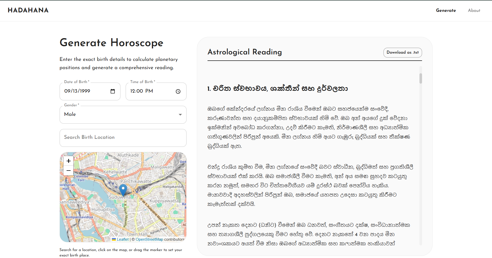
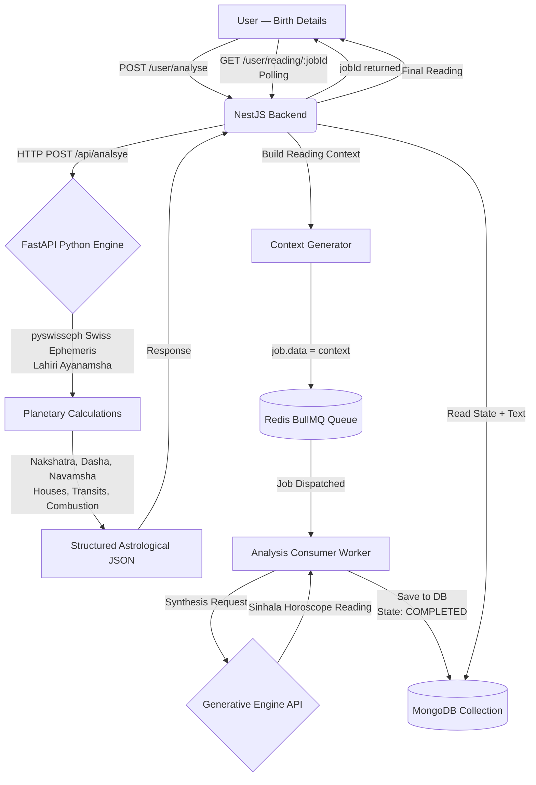

# Hadahana

[](https://nestjs.com/)
[](https://fastapi.tiangolo.com/)
[](https://www.python.org/)
[](https://www.typescriptlang.org/)
[](https://redis.io/)
[](https://www.mongodb.com/)
[](https://pypi.org/project/pyswisseph/)
[](LICENSE)

**Live Preview:** [https://hadahana.codebydumi.space/](https://hadahana.codebydumi.space/)



`Hadahana` (the reading of fate) is an enterprise-grade Vedic astrology platform built for precision and scale. It computes a complete sidereal birth chart using the Swiss Ephemeris (`pyswisseph`) via the Lahiri Ayanamsha, and synthesizes a richly contextualised natural-language horoscope reading in Sinhala.

# Contents

- [Why?](#why)
- [Architecture & Tech Stack](#architecture--tech-stack)
- [Installation](#installation)
- [Configuration](#configuration)
- [Usage](#usage)
- [Mathematical Core](#mathematical-core)
- [What I Learned](#what-i-learned)
- [Future Roadmap](#future-roadmap)

### Why?

We needed a tool that allows you to:
- Generate highly precise astronomical calculations using the industry-standard Swiss Ephemeris.
- Seamlessly offload heavy computational and generation tasks to background queues to prevent HTTP timeouts.
- Dynamically synthesize comprehensive astrological readings in native Sinhala.
- Maintain a strictly decoupled architecture, separating the core mathematical engine from the primary API gateway.

### Architecture & Tech Stack

The system is split into two decoupled microservices:

1. **NestJS Backend**: Handles API requests, job orchestration, queue management, and database state.
2. **FastAPI Python Engine**: Dedicated to high-precision ephemeris calculations, Nakshatra, Dasha, and Navamsha derivations.

Long-running generation tasks are offloaded to a **BullMQ** worker queue backed by **Redis**, enabling horizontal scaling of generation workers.


```mermaid
flowchart TD
    A["User — Birth Details"] -->|"POST /user/analyse"| B("NestJS Backend")

    B -->|"HTTP POST /api/analsye"| C{"FastAPI Python Engine"}
    C -->|"pyswisseph Swiss Ephemeris\nLahiri Ayanamsha"| D["Planetary Calculations"]
    D -->|"Nakshatra, Dasha, Navamsha\nHouses, Transits, Combustion"| E["Structured Astrological JSON"]
    E -->|Response| B

    B -->|"Build Reading Context"| F["Context Generator"]
    F -->|"job.data = context"| G[("Redis BullMQ Queue")]
    G -->|"Job Dispatched"| H["Analysis Consumer Worker"]

    H -->|Synthesis Request| I{"Generative Engine API"}
    I -->|"Sinhala Horoscope Reading"| H

    H -->|"Save to DB\nState: COMPLETED"| J[("MongoDB Collection")]

    B -->|"jobId returned"| A
    A -->|"GET /user/reading/:jobId\nPolling"| B
    B -->|"Read State + Text"| J
    B -->|"Final Reading"| A
```

### Installation

---

#### Prerequisites

- **Node.js** >= 20
- **Python** >= 3.11
- **Redis** server running on `localhost:6379`
- **MongoDB** instance running locally or via Atlas

#### Method 1: Local Development Setup

```bash
# Clone the repository
$ git clone https://github.com/dumidulkdev/Hadahana.git
$ cd Hadahana

# Install NestJS backend dependencies
$ npm install

# Set up Python Engine
$ cd python-engine
$ python -m venv .venv
$ source .venv/bin/activate  # Windows: .venv\Scripts\activate
$ pip install fastapi uvicorn pyswisseph pytz
```

### Configuration

---

Create a `.env` file in the project root:

```bash
$ cp .env.sample .env
```

Ensure the following variables are configured in your `.env` file:

```dotenv
PORT=3000
MONGO_DATABASE_URI=mongodb://localhost:27017/hadahana

ENGINE_BASE_URL=http://localhost:8000
ENGINE_BASE_PATH=/api/analsye

# Required generation key
GEN_AI_API_KEY=your_api_key_here
```

### Usage

---

To run the platform locally, you need to start both the Python calculation engine and the NestJS backend.

**Terminal 1: Python Engine**
```bash
$ cd python-engine
$ source .venv/bin/activate
$ uvicorn main:app --host 0.0.0.0 --port 8000 --reload
```
The engine's interactive docs will be available at `http://localhost:8000/docs`.

**Terminal 2: NestJS Backend**
```bash
$ npm run start:dev
```
The API will be available at `http://localhost:3000`.

#### API Reference

| Method | Endpoint | Description |
|---|---|---|
| `POST` | `/user/analyse` | Submit birth details; returns a `jobId` immediately |
| `GET` | `/user/reading/:jobId` | Poll for the completed reading result |

**Example Request:**
```json
POST /user/analyse
{
  "dateOfBirth": "1992-08-15",
  "timeOfBirth": "14:45",
  "gender": "female",
  "birth_place": {
    "latitude": 6.9271,
    "longitude": 79.8612
  }
}
```

**Example Polling Response:**
```json
{
  "jobId": "b3f2a1c0-...",
  "state": "COMPLETED",
  "reading": "ඔබගේ ලග්නය මේෂ රාශිය වන අතර..."
}
```

### Mathematical Core

---

The system implements a highly precise mathematical framework inside `python-engine/main.py` using the `pyswisseph` library.

#### The 360 Degree Zodiac (Rashis and Nakshatras)

The ecliptic longitude of any celestial body, obtained with the `swe.FLG_SIDEREAL` flag, is a value between 0 and 360 degrees.

- **Rashi (Sign) Index**: `floor(longitude / 30)`
- **Nakshatra Index**: `floor((moon_longitude * 27) / 360)`
- **Pada (Quarter)**: `floor((moon_longitude % 13.333) / 3.333) + 1`

#### Navamsha (D9) Chart Calculation

The Navamsha chart is the ninth harmonic division. Each 30 degree sign is split into 9 equal parts of 3.333 degrees each, producing a secondary chart.

- **Navamsha Rashi Index**: `floor((longitude * 3) / 10) % 12`

#### Bhava (House) Calculation

The Ascendant (Lagna) degree is calculated via `swe.houses_ex()` using the Placidus house system. The house of any planet is its position relative to the Lagna sign, counted inclusively:

- **House**: `((PlanetRashiIndex - LagnaRashiIndex) % 12) + 1`

#### Vimshottari Dasha System

The Vimshottari Dasha is a 120-year cycle of planetary periods (Mahadashas), sequenced by the Nakshatra the Moon occupied at birth. The system iterates through successive Mahadasha lords, subtracting their durations until the current lord and Antardasha sub-period are determined based on exact UTC timestamps.

### What I Learned

---

- **Microservices Architecture & Decoupling**: Learned how to effectively decouple concerns by isolating the high-precision mathematical calculations in a lightweight Python (FastAPI) engine, while maintaining an asynchronous TypeScript (NestJS) backend as the API Gateway.
- **Asynchronous Processing & Queue Management**: Mastered the use of Redis and BullMQ to offload long-running, computationally heavy, and latency-prone generative AI tasks into background worker queues. This prevented HTTP timeouts and allowed for horizontal scaling.
- **Advanced Mapping & Geocoding**: Implemented an interactive, Google-Maps-like location selector from scratch using Leaflet, React, and the OpenStreetMap (Nominatim) API. Learned how to manage interactive map states, fly-to animations, and draggable coordinate markers.

### Future Roadmap

---

- **Kundali Matchmaking (Porutham)**: 10-point compatibility analysis between two birth charts using Ashtakoot scoring.
- **PDF Report Generation**: Export styled horoscope reports using Puppeteer or WeasyPrint.
- **Sinhala Voice Output**: Text-to-speech integration for audio horoscope delivery.
- **Progressive Web App (PWA)**: Offline-capable frontend with interactive birth chart visualization.
- **Shadbala Planetary Strength**: Implement the 6-factor planetary strength scoring.
- **Docker Compose**: One-command setup for the full stack.

### Want to Contribute?

---

Contributions, issues, and feature requests are welcome. Feel free to check the issues page if you want to contribute.
